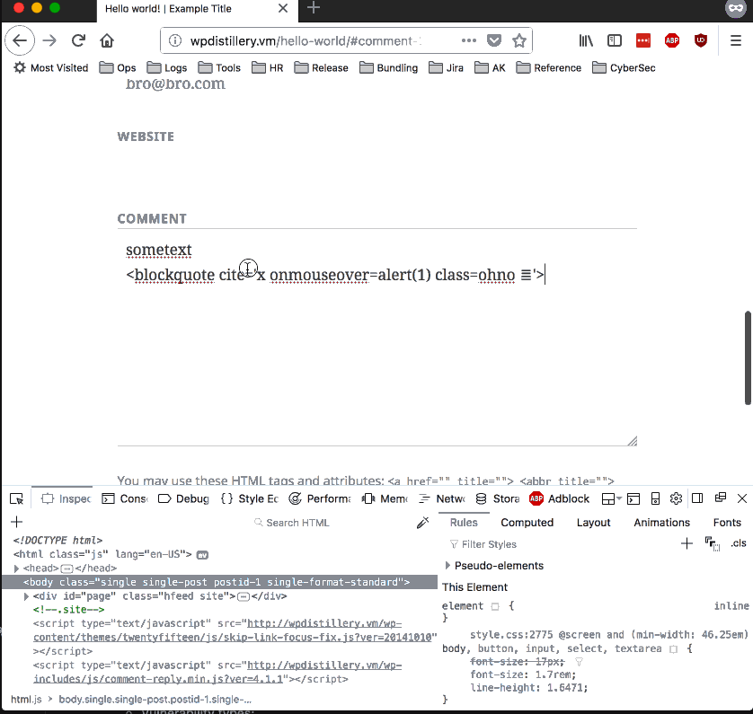
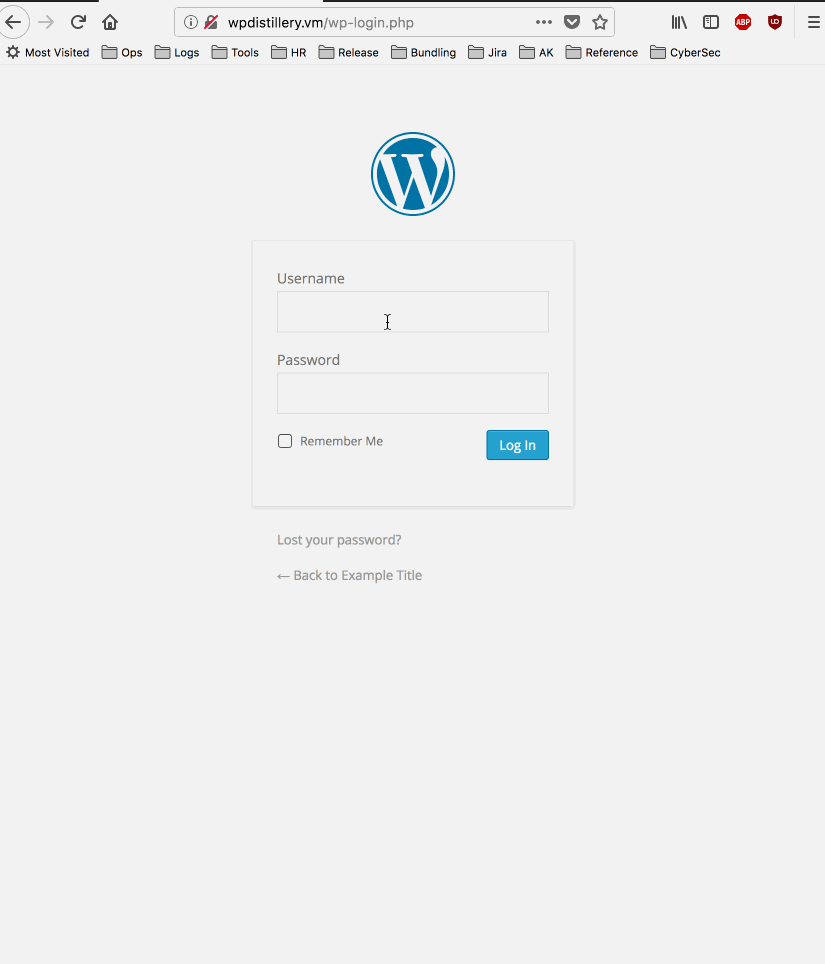
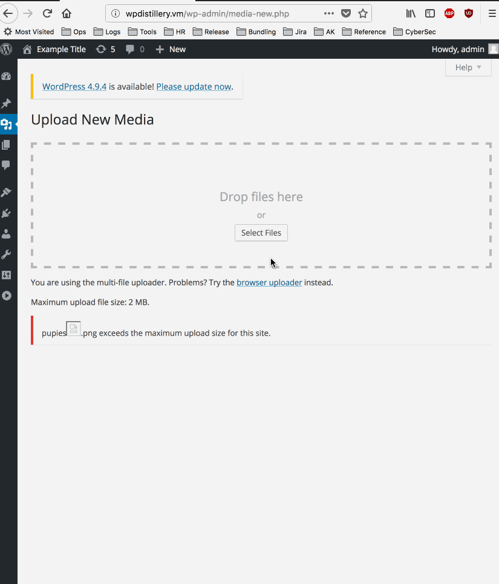

# Project 7 - WordPress Pentesting

Time spent: **3** hours spent in total

> Objective: Find, analyze, recreate, and document **five vulnerabilities** affecting an old version of WordPress

## Pentesting Report

## 1. Un-auth XSS in Comment [CVE-2015-3438](https://nvd.nist.gov/vuln/detail/CVE-2015-3438)

  - Summary:
    - Type: XSS
    - Tested in: 4.1.1
    - Fixed in: 4.1.2
  - GIF Walkthrough:


  - Steps to recreate:

a. I had to add a class into Wordpress, with the following style. In theory an existing class with similar settings can be used. The linked to blog post code did not work for me, and I got style coding removed.

```
.ohno {
  display:block;
  position:fixed;
  width:100%;
  height:100%;
  top:0;
}
```

b. Once the class is know, copy pasting the following code into the comment filed (in Private View) causes XSS. The trick is to use a fancy unicode character.

```
sometext
<blockquote cite='x onmouseover=alert(1) class=ohno 𝌆'>
```
  - Reference: [https://cedricvb.be/post/wordpress-stored-xss-vulnerability-4-1-2/]()


## 2. User Enumeration
  - Summary:
    - Type: User Enumeration
    - Tested in: 4.0.2
    - Fixed in: Current behavior/ Not Fixed
  - GIF Walkthrough:



  - Steps to recreate:

  For any WordPress site, navigate to wp-login.php page and try to enter a username with any password. Error message will indicate if user exists.

## 3. XSS in a Large File Upload - [CVE-2017-9061](https://nvd.nist.gov/vuln/detail/CVE-2017-9061)
  - Summary:
    - Type: XSS
    - Tested in: 4.2
    - Fixed in: 4.7.5,
  - GIF Walkthrough:


  - Steps to recreate:
    Create a file larger than 2mb (max uplaod limit) and add XSS query into it. I used `pupies`. If admin user can be tricked into uploading it, the XSS script will run.

## License

    Copyright 2018 Alex Kras

    Licensed under the Apache License, Version 2.0 (the "License");
    you may not use this file except in compliance with the License.
    You may obtain a copy of the License at

        http://www.apache.org/licenses/LICENSE-2.0

    Unless required by applicable law or agreed to in writing, software
    distributed under the License is distributed on an "AS IS" BASIS,
    WITHOUT WARRANTIES OR CONDITIONS OF ANY KIND, either express or implied.
    See the License for the specific language governing permissions and
    limitations under the License.
